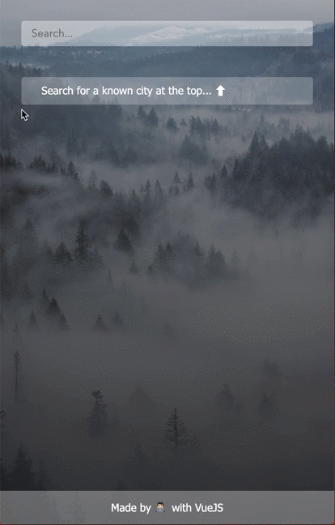

# Vue Weathery
This sample app was created to get a first introduction to VueJs and it's core capabilities (components, templates, styling) as well as the deployment cycle (used netlify here) and its access to other 3rd-party APIs ([Open Weather Map](https://openweathermap.org/api)). 

The following GIF showcases the look and feel of the (small) application.


## Setup instructions
The following instructions help you to run this project yourself.

### Environment Variables
create a `.env`-File or set your environment variables within your hosting service accordingly:
```
VUE_APP_OPENWEATHER_API_KEY=<Your OpenWeatherMap-API-Key here>
```

```
yarn install
```

### Compiles and hot-reloads for development
```
yarn serve
```

### Compiles and minifies for production
```
yarn build
```

### Lints and fixes files
```
yarn lint
```

### Customize configuration
See [Configuration Reference](https://cli.vuejs.org/config/).


